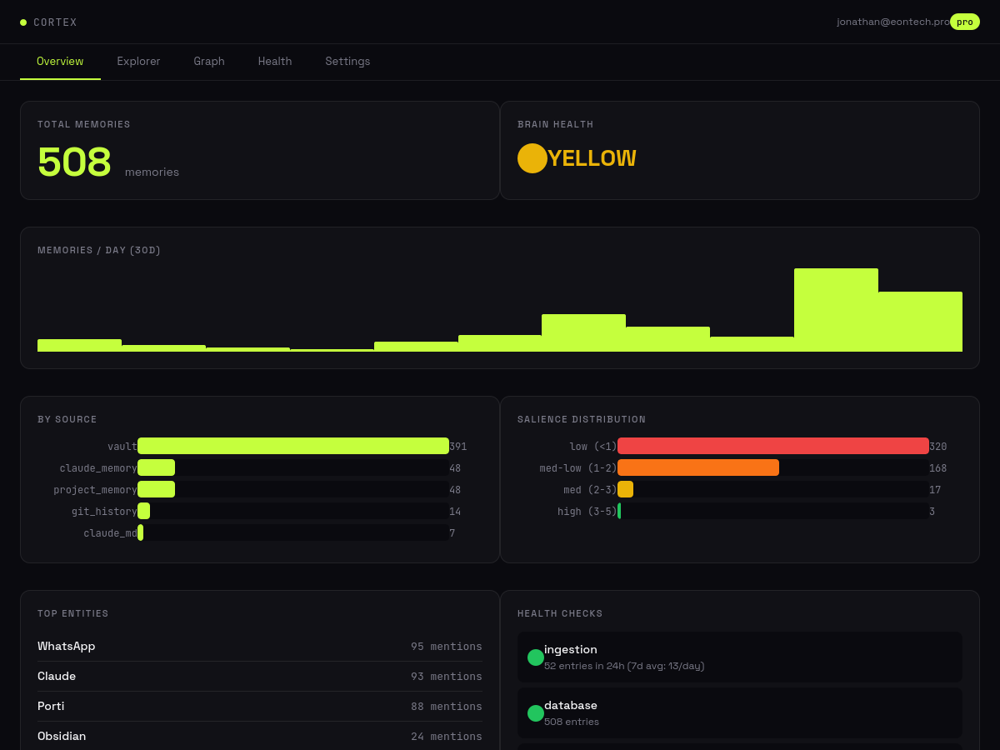

# mem-ria

**A brain for your AI. Not just a database.**

mem-ria gives your AI persistent memory that actively manages itself: scores importance, prunes noise, consolidates knowledge overnight, and diagnoses its own health.





## Quick start (Claude Code)

```bash
npm install -g mem-ria
mem-ria init
# Done. Your Claude Code now has a brain.
```

## Quick start (any AI app)

```bash
npm install @mem-ria/core @mem-ria/brain
```

```typescript
import { createMemory } from '@mem-ria/core'
import { Brain } from '@mem-ria/brain'

const mem = createMemory({ storage: 'sqlite', path: './brain.db' })
const brain = new Brain(mem)

// Save a memory
mem.upsert({ source: 'app', title: 'User prefers dark mode', body: '...', kind: 'preference' })

// Search with importance ranking
const results = mem.search('user preferences')

// Run the brain cycle (scores, prunes, consolidates)
await brain.cycle()

// Check brain health
const health = brain.health()
```

## What makes mem-ria different

Most memory tools do this:

```
save(fact) → vector store → retrieve(query) → top-K results
```

mem-ria does this:

```
ingest → deduplicate → index → score importance → consolidate → prune → self-diagnose
```

| Feature | mem0 | Zep | Letta | **mem-ria** |
|---|---|---|---|---|
| Store + retrieve | yes | yes | yes | yes |
| Vector search | yes | yes | yes | yes (+ BM25 + FTS5) |
| Entity linking | no | yes | no | **yes (canonical + aliases)** |
| Importance scoring | no | no | no | **yes (7 signals)** |
| Nightly consolidation | no | no | no | **yes (6-stage pipeline)** |
| Auto-pruning | no | no | no | **yes (AI + rules)** |
| Self-diagnosis | no | no | no | **yes (6 dimensions)** |
| Multi-tenant | cloud | cloud | no | **yes (org-scoped)** |

## Brain modules

mem-ria's brain is modular, inspired by neuroscience:

| Module | Analogy | What it does |
|---|---|---|
| **Salience** | Amygdala | Scores importance via 7 signals |
| **Pruner** | Synaptic pruning | Archives noise, protects the valuable |
| **Entities** | Associative cortex | Canonical entities + alias resolution |
| **Replay** | Hippocampal replay | Weekly LLM synthesis of top memories |
| **Insular** | Insular cortex | Self-diagnosis: 6 health dimensions |
| **Consolidator** | REM sleep | Merges fragments into dense knowledge |
| **Embeddings** | Wernicke's area | Multi-provider semantic vectors |
| **Proactive** | Prefrontal cortex | Anticipatory briefings |

The brain runs a nightly cycle:

```
03:00  Rescan      — re-index sources
03:15  Prune       — archive noise
03:30  Salience    — recompute importance
03:45  Embeddings  — vectorize new entries
04:00  Insular     — self-diagnosis
04:30  Replay      — weekly synthesis (Sundays)
```

## Packages

| Package | What | Install |
|---|---|---|
| `@mem-ria/core` | Storage + CRUD + search | `npm i @mem-ria/core` |
| `@mem-ria/brain` | Brain modules + adapters | `npm i @mem-ria/brain` |
| `@mem-ria/connectors` | Data source plugins | `npm i @mem-ria/connectors` |
| `@mem-ria/extractor` | Auto-extract facts from conversations | `npm i @mem-ria/extractor` |
| `@mem-ria/mcp` | MCP server for Claude Code | `npm i @mem-ria/mcp` |
| `@mem-ria/server` | HTTP API server | `npm i @mem-ria/server` |
| `mem-ria` | CLI | `npm i -g mem-ria` |

## CLI

```bash
mem-ria init                    # Initialize brain + configure Claude Code MCP
mem-ria serve                   # Start MCP server
mem-ria serve --http            # Start MCP + HTTP API
mem-ria search "query"          # Search memory
mem-ria status                  # Brain health + stats
mem-ria cycle                   # Run brain cycle manually
mem-ria scan                    # Run connectors
mem-ria doctor                  # Diagnose installation
mem-ria config                  # Show/edit config
```

## MCP tools (Claude Code)

When connected via MCP, Claude Code gets these tools:

| Tool | Description |
|---|---|
| `memory_search` | Search with BM25 + salience + temporal decay |
| `memory_save` | Save fact/decision/preference |
| `memory_entities` | List known entities |
| `memory_entity_detail` | Everything about an entity |
| `brain_status` | Health diagnostics |
| `brain_cycle` | Trigger consolidation |
| `memory_stats` | Memory statistics |

## HTTP API (multi-agent)

```bash
# Start server
mem-ria serve --http --port 3333

# Save memory
curl -X POST localhost:3333/api/memory \
  -H "Content-Type: application/json" \
  -d '{"source":"app","title":"Important fact","body":"..."}'

# Search
curl "localhost:3333/api/memory/search?q=important"

# Agent-scoped (multi-agent mode)
curl -H "X-Mem-Ria-Agent: rafael" localhost:3333/api/memory/search?q=client

# Brain health
curl localhost:3333/api/brain/health
```

## Connectors

Built-in connectors for data ingestion:

| Connector | Source |
|---|---|
| `claudeMemoryConnector` | `.claude/projects/*/memory/*.md` |
| `claudeMdConnector` | `CLAUDE.md` files |
| `markdownVaultConnector` | Any folder of `.md` files (Obsidian, etc.) |
| `gitHistoryConnector` | Git commits and decisions |
| `filesystemConnector` | Watch directories for changes |

## Multi-agent support

Same brain, different scopes:

```typescript
// Personal mode (Claude Code)
mem-ria init --mode personal

// Multi-agent mode
mem-ria init --mode multi-agent --agents rafael,camila,isabela
```

Agents get isolated memory with shared org scope:

```
agent:rafael  → only Rafael sees this
agent:camila  → only Camila sees this
org:porti     → everyone sees this
global        → always visible
```

## License

MIT
